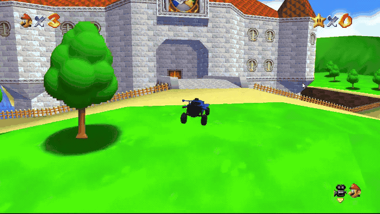
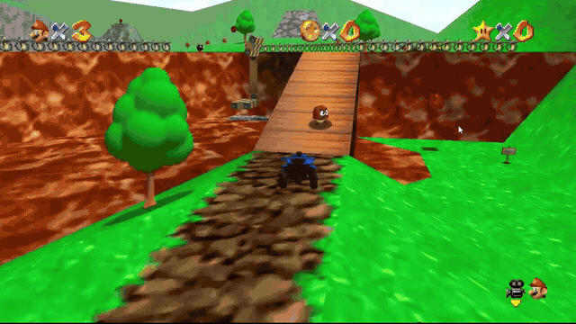

# Super Rocket 64

**Jump, flip, boost and fly through Super Mario 64 in a Octane.**

Take a rocket-powered car into a familiar world: launch over the castle moat, climb the hills of Bob-omb Battlefield, and find a different line through every course. Octane is the default character.

**Windows x64 preview available.** Download the standalone EXE from [Releases](https://github.com/RyanCraighead/super-rocket-64/releases). You supply the supported games locally; setup handles Python and the pinned extraction tool. See [verification and limitations](docs/RELEASE-STATUS.md).

## What to expect

- Car movement built on RocketSim: throttle, brake, reverse, powerslide, jumps, directional flips, boost and aerial control.
- SM64 exploration and progression, with car interactions for enemies, bosses, doors, caps, platforms and blue coin switches.
- Five boost points per collected coin, capped at 100. No passive boost refill.
- An offline character wheel with Mario, Octane, Link, Bomberman, Banjo-Kazooie, Spider-Man and Tony Hawk when their assets are installed.
- Direct-IP multiplayer for **Mario and Octane only**, over a reachable LAN or a user-configured Tailscale connection.

RocketSim is an approximate reconstruction. This is a fan project, not Rocket League's original physics engine or a complete port of any optional character's game. Some gameplay and multiplayer cases still need native acceptance testing.

## Install and play

First-time setup:

1. Download the **Super Rocket 64 Windows x64 EXE** from this repository's Releases page.
2. Open it and choose your own supported **Super Mario 64 US ROM** and **Rocket League installation**. Setup checks their contents, obtains the pinned extraction tools, and builds your assets locally. You do not install Python or manage UE Viewer yourself.
3. Choose **No** for optional characters to finish, or **Yes** to select additional characters and provide only their required game files.
4. Choose **Offline** to enter the game as Octane. Hold **F7** or the controller's **Share/Back** button to open the character wheel on safe ground.

Exact supported releases matter. Rocket League extraction currently accepts the audited **Steam build 25535926** package profile; support for an arbitrary current Steam or Epic installation is not claimed. See [supported source games and formats](docs/ASSET-SOURCES.md) before preparing files.

Your ROMs, extracted assets, saves and controller settings stay on your PC. They are never part of the public download. Setup is designed to validate cached tools and completed profiles, resume after a failed optional installation, and preserve saves across launcher updates.

## Play together

1. Both players prepare their own SM64 and Octane assets and use matching Super Rocket 64 builds.
2. Choose **Online**, then **Host** or **Join**. Only Mario and Octane are supported online.
3. **Host:** choose a port, starting with **7777**. Share your reachable LAN address, or your Tailscale address if both PCs already have access to the same tailnet. The listen address is not an address to send to your friend.
4. **Join:** enter the host's IP address and matching port.

Tailscale is configured by you outside the launcher. Address detection does not prove another PC can connect. The launcher does not change your firewall, VPN, router or security settings. Two-PC/WAN acceptance is still pending; direct-IP support is not a guarantee that every network route works.

## Setup and recovery

- **Reusing a valid setup:** leave source fields blank and run setup; it verifies existing assets first and asks for inputs only if needed.
- **A ROM is rejected:** check the exact region/revision and accepted format in the source-game list. Renaming a file does not convert or validate it.
- **Rocket League is rejected:** this version supports the audited Steam build 25535926 packages. An arbitrary Steam/Epic build is not interchangeable; the error identifies the missing or mismatched package.
- **An optional character fails:** the completed SM64/Octane setup remains available. Go Back to play, or correct that game's input and retry only its setup.
- **Setup is canceled:** wait for cleanup to finish, then retry. Completed profiles are reused; an incomplete new stage is discarded. A repaired profile retains its previous copy for recovery.
- **A stale lock is reported after a crash:** first close every setup/game instance using that data folder. Remove only the empty lock directory named by the error (`.seven-setup-lock` or `.launch-lock`), then retry. Keep the profiles, save files and controller configuration.

## Controls

| Action | Xbox / PlayStation | Keyboard |
| --- | --- | --- |
| Throttle / brake / reverse | RT / LT; R2 / L2 | W / S |
| Steer / air yaw | Left stick horizontal | A / D |
| Air pitch | Left stick vertical | W / S |
| Jump / second jump / flip | A / Cross | L |
| Boost | B / Circle | Comma |
| Powerslide / air roll | X / Square | K with A / D |
| Pause | Start / Options | Space |
| Character wheel | Back / Share | Hold F7 |

Car bindings are editable under **Options > Controls > Car Controller**. Mappings and boost preferences are saved locally. Generic joysticks need an appropriate SDL controller mapping. Physical-controller verification for the public edition is pending.

## Credits

Super Rocket 64 is a fan project by [Ryan Craighead](https://github.com/RyanCraighead), built from the work of the [SM64coopdx contributors](https://github.com/coop-deluxe/sm64coopdx), the SM64 decompilation community, [RocketSim](https://github.com/ZealanL/RocketSim), [Bullet](https://github.com/bulletphysics/bullet3), [UE Viewer](https://github.com/gildor2/UEViewer), and the original-data character research and conversion work documented with the project.

Mario and Super Mario 64 belong to Nintendo. Rocket League and Octane belong to Psyonix/Epic Games. Other characters, games and trademarks belong to their respective owners. This project is unaffiliated with those owners. Component licenses and attribution must be retained; no blanket license for proprietary game content is asserted.

Gameplay GIFs are cropped in time from the creator's own captured footage. The chat introduction and audio are excluded.

[Release status](docs/RELEASE-STATUS.md) · [Source games](docs/ASSET-SOURCES.md) · [Maintaining the public edition](docs/MAINTENANCE.md)
